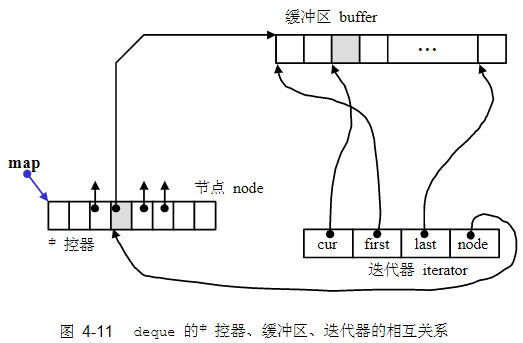

# 序列式容器

## 4.2 vector

**vector 的迭代器**：vector 维护的是一个连续线性空间，所以 vector 的迭代器就是普通指针，不论元素型别是什么，且 vector 提供的是 Random Access Iterator。

vector 内部以三个迭代器来操作容器内的元素，如下所示：
```cpp
template<class T, class Alloc = alloc>
class vector {
protected:
  iterator start;           // 表示目前使用空间的头
  iterator finish;          // 表示目前使用空间的尾
  iterator end_of_storage;  // 表示目前可用空间的尾
};
```

[4_2_5_vector-test.cpp](4_2_5_vector-test.cpp)：vector 容器操作

[4_2_2_stl_vector.h](4_2_2_stl_vector.h)：SGI STL 的 vector 源代码，重点关注注释的部分，包括：
- push_back 函数，内部调用了 inset_aux 函数
- pop_back 函数
- erase 函数
- clear 函数
- insert 函数，代码比较重要，STL 的插入操作标准规范是插入的新节点位于插入点（迭代器，即插入位置）前方

> 注意事项：对 vector 的任何操作，一旦引起空间重新配置，指向原 vector 的所有迭代器就都失效了，因为 vector 的迭代器就是普通指针，空间重新配置后，原位置 vector 会被释放掉。

## 4.3 list

list 的节点结构如下：
```cpp
template<class T>
struct __list_node {
    // 型别其实可以为 __list_node<T>*
    typedef void* void_pointer;
    void_pointer prev;
    void_pointer next;
};
```

对于 vector，其迭代器就是指针，所以 vector 是 Random Access Iterator，而 list 并不是，所以需要设计迭代器结构，实现递增、递减等操作，实现一个 Bidirectional Iterator，具体实现见 stl_list.h。

> 注意事项：插入操作（insert）和接合操作（splice）都不会造成原有的 list 迭代器失效，甚至 list 元素删除操作也只有“指向被删除元素”的迭代器失效。

list 的结构不仅是一个双向链表，还是一个环形双向链表，只需要一个指向尾端空白节点的 node 指针就可以表示整个环状链表。

[4_3_5_list-test.cpp](4_3_5_list-test.cpp)：测试 list 容器操作

[4_3_2_stl_list.h](4_3_2_stl_list.h)：SGI STL 的 list 源代码，重点关注注释的部分，包括：
- 迭代器的设计
- list 的构造与内存管理
- list 的元素操作：push_back、push_front、erase、pop_front、pop_back、clear、remove、unique、splice、merge、reverse、sort
- 对于 sort 函数，这是 merge sort 的迭代实现，内部调用了 splice（内部调用了 transfer 迁移操作函数）接合函数和 merge 合并函数

[4_3_6_merge_sort.cpp](4_3_6_merge_sort.cpp)：迭代版归并排序，参考 sgi stl stl_list.h 里的 list 内置 sort

> 注意事项：merge 合并操作合并两个升序排序的链表，链表一定要已经排好序。

## 4.4 deque

相比于 vector，deque 允许在常数时间内对头端进行元素的插入或移除操作。deque 的迭代器也是 Random Access Iterator，但不是普通指针，内部实现了一个 __deque_iterator 迭代器结构，其中几个重要的结构如下所示：
```cpp
template <class T, class Ref, class Ptr, size_t BufSiz>
struct __deque_iterator { // 未继承 std::iterator
  // 未继承 std::iterator，所以必须自行撰写五个必要的迭代器相应型别
  typedef random_access_iterator_tag iterator_category;
  typedef T value_type;
  typedef Ptr pointer;
  typedef Ref reference;
  typedef size_t size_type;
  typedef ptrdiff_t difference_type;
  typedef T** map_pointer;

  typedef __deque_iterator self;

  // 保持与容器的联结
  T* cur;     // 此迭代器所指之缓冲区中的现行（current）元素
  T* first;   // 此迭代器所指之缓冲区的头
  T* last;    // 此迭代器所指之缓冲区的尾（含备用空间），last 指向最后一个元素后一个位置
  map_pointer node;     // 指向管控中心
```

deque 的中控器：deque 采用一块所谓的 map 作为主控，map 是一小块连续空间，里面每个元素（node）都是指针，指向另一段连续线性空间（缓冲区），在缓冲区中储存数据。deque 内部有三个重要的成员，如下所示：
```cpp
template<class T, class Alloc = alloc, size_t BufSiz = 0>
class deque {
public:
  typedef T value_type;
  typedef value_type* pointer;
  typedef size_t size_type;
protected:
  typedef pointer* map_pointer;

protected:
  iterator start;     // 迭代器，里面的 cur 指向第一缓冲区的第一个元素
  iterator finish;    // 迭代器，里面的 cur 指向最后缓冲区的最后一个元素的下一个位置，和 start 不同，这个很重要

  map_pointer map;    // 指向 map，map 是块连续空间，其内的每个元素
                      // 都是一个指针（称为节点），指向一块缓冲区
  size_type map_size; // map 内可容纳多少指针
}
```

注意搞清楚迭代器里的 cur、first、last 和 deque 容器里的 start、finish 的关系。下图显示了中控器、缓冲区、迭代器的相互关系：



[4_4_2_stl_deque.h](4_4_2_stl_deque.h)：SGI STL 的 deque 源代码，包含了迭代器设计和容器设计

[4_4_5_deque-test.cpp](4_4_5_deque-test.cpp)：deque 容器操作测试程序

**deque 的构造与内存管理**

构造函数：
- 构造函数 deque(n, value)：创建一个 deque，包含 n 个元素，初值为 value，调用 fill_initialize 函数
- fill_initialize(n, value)：负责产生并安排好 deque 的结构，内部调用了 create_map_and_nodes 和 uninitialized_fill
- create_map_and_nodes(n)：负责产生并安排好 deque 的结构，配置 map 的空间和每个缓冲区的空间

push_back() 函数：
- 最后缓冲区还有两个或以上元素时，直接在备用空间上构造元素
- 最后缓冲区只剩一个元素时，调用 push_back_aux 函数

push_back_aux 函数：
- 如果 map 尾端节点备用空间不足（这里是 map），需要重新配置一个 map
- 否则直接配置一个新节点（缓冲区）

push_front 操作和 push_back 同理。

**deque 的元素操作**

pop_back() 函数：拿掉尾部元素，需要考虑释放缓冲区，调用 pop_back_aux 释放缓冲区

pop_front() 函数和 pop_back() 同理。

clear() 函数：清除整个 deque，注意，deque 的最初状态（无任何元素时）保有一个缓冲区，因此，clear 之后也一样保留一个缓冲区

erase(pos)：清除某个位置的元素
- 如果 pos 前面元素比较少，就把前面元素后移
- 如果 pos 后面元素比较少，就把后面元素前移
- 最后析构一个冗余元素

erase(first, last)：清除 [first, last) 内的所有元素
- 如果清除区间前面元素比较少，就把前面元素后移
- 如果清除区间后面元素比较少，就把后面元素前移
- 最后析构所有冗余元素

insert(pos, x)：在 pos 前插入一个元素，初值为 x，如果插入点不是最前端或最后端，就调用 inset_aux 去做

insert_aux(pos, x)：移动插入点 pos 前面或后面的元素
- 如果 pos 前面元素比较少，在最前端插入一个元素（push_front），前面的元素（除了front）往前移动一个元素位置
- 如果 pos 后面元素比较少，在最尾端插入一个元素（push_back），后面的元素（除了back）往后移动一个元素位置
- 在插入点 pos 设定新值 x

## 4.5 stack

stack 不是容器，是一种容器适配器（adapter），默认使用 deque 作为底层容器。

> stack 没有迭代器。

[4_5_2_stl_stack.h](4_5_2_stl_stack.h)：SGI STL 的 stack 源代码，很短。

[4_5_4_stack-test.cpp](4_5_4_stack-test.cpp)：测试使用 list 作为 stack 的底层容器。

## 4.6 queue

[4_6_2_stl_queue](4_6_2_stl_queue.h)：SGI STL 的 queue 源代码，也包括了 priority_queue 的源代码

[4_6_4_queue-test](4_6_4_queue-test.cpp)：测试使用 list 作为 queue 的底层容器。

## 4.7 heap

binary heap （堆）：
- 结构上：就是一种 complete binary tree（完全二叉树）
- 堆序性：除了堆顶外，每个节点的优先级都不大于其父节点

因为堆是一种完全二叉树，所以整棵树内没有任何漏洞，可以用一个 array（实际用vector） 来储存所有节点。这种以 array 表述 tree 的方式，称为隐式表述法（implicit representation）

堆顶元素下标为 0，则对于下标为 “i” 的节点：
- 左子节点位于 “2i + 1” 处，右子节点位于 “2i + 2” 处
- 父节点位于 “(i - 1) / 2” 处
- 一共 n 个节点的 heap，最后一个非叶子节点是最后一个节点 “n - 1” 的父节点，下标为 “(n - 2) / 2”

堆顶元素下标为 1，则对于下标为 “i” 的节点：
- 左子节点位于 “2i” 处，右子节点位于 “2i + 1” 处
- 父节点位于 “i / 2” 处
- 一共 n 个节点的 heap，最后一个非叶子节点是最后一个节点 “n” 的父节点，下标为 “n / 2”

[4_7_2_stl_heap.h](4_7_2_stl_heap.h)：STL 里的 heap 算法，都是泛型算法，传入的参数是迭代器

**heap 算法**

push_heap：
- 先把元素插入底层 vector 的 end() 处（并不是 push_heap调用的，需要用户自行完成）
- 对 vector 的 end() 元素执行 percolate up（上滤），直到满足堆序性或到达堆顶

pop_heap：
- 先把堆顶元素放到最后，之前最后的元素，然后现在堆顶没有元素，是个 holeIndex（洞值）
- 在 holeIndex 的左右子节点中找到较大的那个放到 holeIndex 处，较大的子节点成为新的洞值，即 percolate down（下滤）操作
- 一直到叶子节点，然后把之前最后的元素赋给它，再执行一次 percolate up（上滤）操作，因为有可能不满足堆序性
- 实际上上一步是直接调用了 __push_heap，也并没有把之前最后的元素值赋给叶子节点，只是把它当做一个新的 holeIndex，执行了 percolate up

感觉 STL 的 pop_heap 复杂了，可以简化：
- 先把堆顶元素放到最后，把最后一个元素放到堆顶（相当于交换）
- 对堆顶元素，执行 percolate down 即可

sort_heap 算法：
- 执行 pop_heap 把堆顶元素放到最后，调整 heap 结构
- 堆的范围缩小 1，即 --last
- 重复前两步直到 heap 内只剩下一个元素

make_heap 算法：将一段现有的数据转化为 heap
- 从最后一个节点的父节点开始，倒序对每个节点执行 percolate down
- 直到首节点

> heap 的底层容器设置为 vector 最好，因为可以动态增长。


## 4.8 priority_queue

优先级队列，默认是一个 max-heap，底层容器选用 vector。并不是容器，归类为容器适配器。

[4_6_2_stl_queue](4_6_2_stl_queue.h)：priority_queue 的源代码也在 queue 头文件中

[4_8_4_pqueue-test.cpp](4_8_4_pqueue-test.cpp)：测试 priority_queue 使用


## 4.9 slist

slist 和 list 的主要差别在于迭代器前者是单向的 Froward Iterator，后者是双向的 Bidirectional Iterator。

push_front 是头插法，所以元素的次序会和插入的次序相反。

slist 节点和迭代器的设计比 list 复杂，用了继承关系

[4_9_2_stl_slist.h](4_9_2_stl_slist.h)：slist 节点、迭代器和容器结构，前两者用了继承关系，都继承自自己的 base class

[4_9_5_slist-test.cpp](4_9_5_slist-test.cpp)：slist 容器操作测试程序